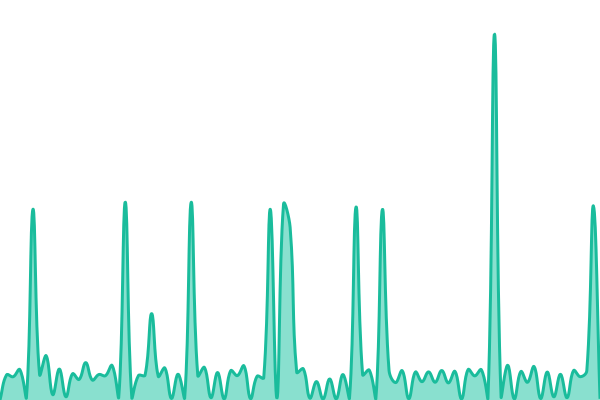
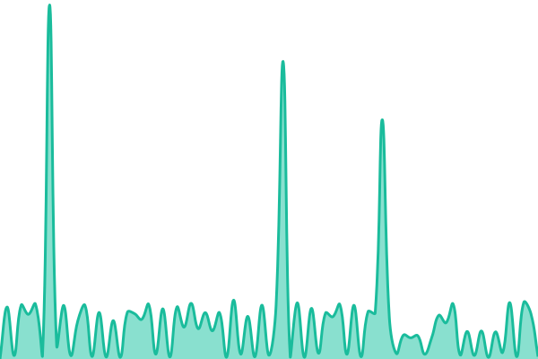

# [📈 Live Status](https://TransparentLC.github.io/status): <!--live status--> **🟧 Partial outage**

This repository contains the open-source uptime monitor and status page for [✨ 小透明・宸 ✨](https://akarin.dev), powered by [Upptime](https://github.com/upptime/upptime).

With [Upptime](https://upptime.js.org), you can get your own unlimited and free uptime monitor and status page, powered entirely by a GitHub repository. We use [Issues](https://github.com/TransparentLC/status/issues) as incident reports, [Actions](https://github.com/TransparentLC/status/actions) as uptime monitors, and [Pages](https://TransparentLC.github.io/status) for the status page.

<!--start: status pages-->
<!-- This summary is generated by Upptime (https://github.com/upptime/upptime) -->
<!-- Do not edit this manually, your changes will be overwritten -->
<!-- prettier-ignore -->
| URL | Status | History | Response Time | Uptime |
| --- | ------ | ------- | ------------- | ------ |
|  [Cloudreve](https://file.akarin.dev/api/v4/site/ping) | 🟩 Up | [cloudreve.yml](https://github.com/TransparentLC/status/commits/HEAD/history/cloudreve.yml) | 

 1070ms
     
 | 

<a href="https://TransparentLC.github.io/status/history/cloudreve">99.85%</a>
    

|  frp tunnel | 🟩 Up | [frp-tunnel.yml](https://github.com/TransparentLC/status/commits/HEAD/history/frp-tunnel.yml) | 

 149ms
     
 | 

<a href="https://TransparentLC.github.io/status/history/frp-tunnel">100.00%</a>
    

|  [Mail server](smtp.akarin.dev) | 🟩 Up | [mail-server.yml](https://github.com/TransparentLC/status/commits/HEAD/history/mail-server.yml) | 

 226ms
     
 | 

<a href="https://TransparentLC.github.io/status/history/mail-server">99.85%</a>
    

|  Hakurei Shrine | 🟩 Up | [hakurei-shrine.yml](https://github.com/TransparentLC/status/commits/HEAD/history/hakurei-shrine.yml) | 

 557ms
     
 | 

<a href="https://TransparentLC.github.io/status/history/hakurei-shrine">99.85%</a>
    

|  Moriya Shrine | 🟩 Up | [moriya-shrine.yml](https://github.com/TransparentLC/status/commits/HEAD/history/moriya-shrine.yml) | 

 2348ms
     
 | 

<a href="https://TransparentLC.github.io/status/history/moriya-shrine">100.00%</a>
    

|  Hath | 🟩 Up | [hath.yml](https://github.com/TransparentLC/status/commits/HEAD/history/hath.yml) | 

 407ms
     
 | 

<a href="https://TransparentLC.github.io/status/history/hath">100.00%</a>
    

|  [Crypto Lab](https://crypto-lab.akarin.dev/) | 🟥 Down | [crypto-lab.yml](https://github.com/TransparentLC/status/commits/HEAD/history/crypto-lab.yml) | 

 2407ms
     
 | 

<a href="https://TransparentLC.github.io/status/history/crypto-lab">85.37%</a>
    

|  [Qsticker Archive](https://qsticker.akarin.dev/) | 🟥 Down | [qsticker-archive.yml](https://github.com/TransparentLC/status/commits/HEAD/history/qsticker-archive.yml) | 

 1100ms
     
 | 

<a href="https://TransparentLC.github.io/status/history/qsticker-archive">84.52%</a>
    

|  [dufs file sharing](https://fuwafuwa.akarin.dev/__dufs__/health) | 🟥 Down | [dufs-file-sharing.yml](https://github.com/TransparentLC/status/commits/HEAD/history/dufs-file-sharing.yml) | 

 1101ms
     
 | 

<a href="https://TransparentLC.github.io/status/history/dufs-file-sharing">84.80%</a>
    

<!--end: status pages-->

[**Visit our status website →**](https://TransparentLC.github.io/status)

## 📄 License

- Powered by: [Upptime](https://github.com/upptime/upptime)
- Code: [MIT](./LICENSE) © [✨ 小透明・宸 ✨](https://akarin.dev)
- Data in the `./history` directory: [Open Database License](https://opendatacommons.org/licenses/odbl/1-0/)
